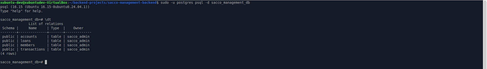
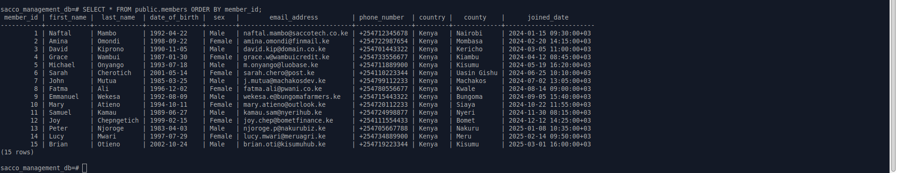
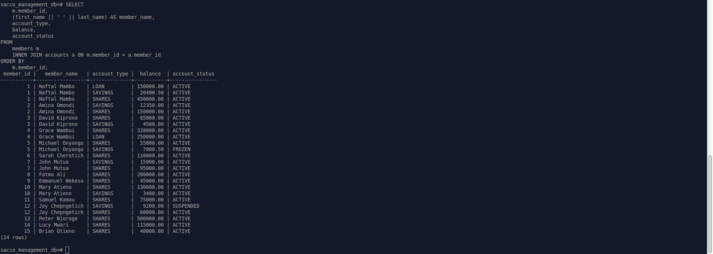

# Sacco Management Database - Prototype

### 🖥️ System Overview

This project is a secure banking database built using **PostgreSQL**. It safely manages member profiles, tracks savings accounts, handles loan records, and stores a clean history of every transaction. By using strict safety rules built directly into the database, it completely blocks duplicate transaction errors and protects the system from accidental negative balances.

**Development Methodology:** This project follows a systematic **back-to-front approach**. In this current phase, the foundational database layer has been fully engineered. All core schemas, unique national ID domain validations, and strict table constraints were established first to ensure absolute data safety before any backend application or server code is introduced.

---

### 🎯 The Business Problem

Many savings and credit co-operatives (SACCOs) rely on slow, manual ledger books or basic spreadsheet records to track member accounts and loan repayment streams. This manual process causes delayed financial reporting, human calculation errors, double-entry balance discrepancies, and boundary corruption that compromises data integrity.

### 💡 The Engineered Solution

This application completely automates transaction ledger tracking, member accounts, and credit allocation. By building a direct relational database architecture split across specialized modules, SACCO managers can execute dynamic financial audits, track amortization paths, and view real-time account balances instantly. This eliminates manual ledger drift, protects transactional integrity, and completely prevents unauthorized overdraft anomalies.

---

## 📸 System Preview

### 1. Active Database Tables

This terminal screenshot shows that our four core tables (`members`, `accounts`, `transactions`, and `loans`) are successfully built inside the database. It proves that all tables are uniformly owned by the `sacco_admin` user account:


### 2. Live Seeded Member Records

This terminal screenshot shows our main `members` table working live with real information. It proves that all our safety rules—like blocking duplicate national ID numbers and sorting rows smoothly by Member ID—are working perfectly on the disk:


### 3. Business Analytics Report Execution

This terminal screen log captures a report listing all members alongside their financial accounts. It connects personal details with live account balances. Management uses this for daily audits to track who owns what account:


---

## 🛠️ Tech Stack Used

- **Operating System:** Linux Ubuntu (VirtualBox Environment)
- **Database Engine:** PostgreSQL SQL Database (PL/pgSQL)
- **Development Tooling:** Linux Terminal, VS Code Editor
- **Version Control:** Git / GitHub Repository Pipeline

---

## 🗂️ Project Directory Structure

This map shows the location of every file created inside the project directory:

```text
~/sacco-management-backend/
├── README.md                   # System documentation and developer setup guide
├── LICENSE                     # Open-source MIT License terms and conditions
├── images/
│   ├── tables.png              # Terminal screenshot of relational database tables
│   ├── membertable.png         # Terminal screenshot of active members table records
│   └── balancesheetquery.png   # Terminal screenshot of master member balance sheet report
├── schema/
│   ├── 01_members.sql          # Core member data structural blueprints
│   ├── 02_accounts.sql         # Account tracking schemas and constraints
│   ├── 03_transactions.sql     # Ledger transaction tables and audit logs
│   ├── 04_loans.sql            # Credit facilities and loan repayment schedules
│   └── 05_indexes.sql          # Customized B-Tree and execution indexing layers
├── seeding/
│   └── seeding.sql             # Core records and initial table inputs
└── queries/
    └── analytics.sql           # Reference SQL multi-table JOIN aggregation scripts
```

---

## 📋 System Prerequisites

You must install the following software packages before running the database engine:

1. **PostgreSQL Server:** Required to host the local relational database vault.
   - _Ubuntu command to install:_ `sudo apt install postgresql postgresql-contrib`
2. **Git:** Required to clone the project files from GitHub.
   - _Ubuntu command to install:_ `sudo apt install git`

---

## 📟 Setup and Execution Guide

Follow these steps in order to download, initialize, and query the database engine:

### Step 0: Clone and Enter the Project Folder

Open your Linux terminal, download the repository, and enter the main project folder:

```bash
# Clone the repository onto your machine
git clone https://github.com/naftalmambo/sacco-management-backend

# Move into the project directory
cd sacco-management-backend
```

### Step 1: Initialize and Seed the Database

Run these commands in order to create your database tables sequentially, mount your performance optimization indexes, and insert the default member records inside your database:

```bash
# Rebuild the database tables sequentially
sudo -u postgres psql -d sacco_management_db -f schema/01_members.sql
sudo -u postgres psql -d sacco_management_db -f schema/02_accounts.sql
sudo -u postgres psql -d sacco_management_db -f schema/03_transactions.sql
sudo -u postgres psql -d sacco_management_db -f schema/04_loans.sql

# Load the performance tuning indexes
sudo -u postgres psql -d sacco_management_db -f schema/05_index.sql

# Seed the initial member data records
sudo -u postgres psql -d sacco_management_db -f seeding/seed_data.sql
```

### Step 2: Configure Database User Security

Update your PostgreSQL user permissions to authorize localized database management connectivity:

```bash
sudo -u postgres psql -c "ALTER USER sacco_admin WITH PASSWORD 'mamboSecure2012';"
```

### Step 3: Verify Your Database Tables (Interactive Prompt)

If you want to log into your PostgreSQL database manually to verify that your layout loaded correctly, run these commands inside your terminal:

1. **Log in to the database dashboard terminal:**
   ```bash
   sudo -u postgres psql -d sacco_management_db
   ```
2. **List all active tables:** Type the list command and press Enter:
   ```sql
   \dt;
   ```
3. **List all custom optimization indexes:** Type the index overview command and press Enter:
   ```sql
   \di;
   ```
4. **Audit and display member records:** Run the data dump check and press Enter:
   ```sql
   SELECT * FROM public.members ORDER BY member_id;
   ```
5. **Exit the interactive database prompt:** Type the quit command to return to your normal terminal window:
   ```sql
   \q;
   ```

---

## 📊 Core Analytical Query: Member Balance Sheet

This is the main database query used to pull a complete, unified financial report. It combines personal member details with their active account metrics into a single, clean tracking grid:

- **What it does:** It automatically combines the `members` and `accounts` tables to show exactly who owns what account.
- **How it works:** It connects the tables using an `INNER JOIN`, merges first and last names together with a clean space, and sorts the entire list smoothly by Member ID from lowest to highest.

```sql
SELECT
    m.member_id,
    (first_name || ' ' || last_name) AS member_name,
    account_type,
    balance,
    account_status
FROM
    members m
    INNER JOIN accounts a ON m.member_id = a.member_id
ORDER BY
    m.member_id;
```

---

## 🧠 Lessons Learned

- **Splitting Up Database Blueprints:** Practiced breaking a database system down into separate files (`01_members`, `02_accounts`, `03_transactions`, and `04_loans`) to make the setup cleaner and easier to manage.
- **Making Queries Run Faster:** Learned how to create custom performance shortcuts (B-Tree indexes) inside a standalone `index.sql` script to eliminate search lag when pulling large reports.
- **Linking Multiple Tables Together:** Mastered how to write clean `INNER JOIN` and `LEFT JOIN` queries to link four different tables together and build a complete member balance sheet.
- **Protecting Financial Balances:** Learned how to create a custom database data type (Domain Validation) with a strict zero-minimum rule to completely block accidental negative balances and stop transaction errors before they hit the disk.

---

## 🤝 Acknowledgments & Collaboration

- **AI Collaboration:** Developed in partnership with Google AI as an engineering peer. Used Google AI to brainstorm relational schemas, troubleshoot multi-table constraint fields, and refine professional developer code documentation.

---

## 🚀 Future Upgrades

1. **Connect to Java (JDBC):** Build a java backend layer that connects directly to this database so users can check balances and make transactions from a terminal menu.
2. **Advanced Business Queries:** Add complex analytical scripts to track monthly growth trends, identify high-performing member cohorts, and automatically flag high-risk credit accounts.
3. **Automated Interest & Penalties:** Write database triggers that run automatically at the end of every month to calculate savings interest and apply late fees to overdue loans.
4. **Admin Activity Logs:** Design a hidden audit table that automatically logs the timestamp and user account every time a balance or loan record is changed for extra security.
